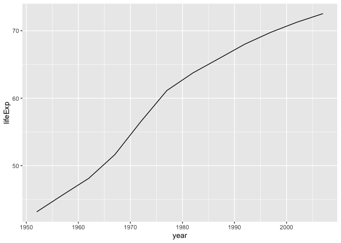
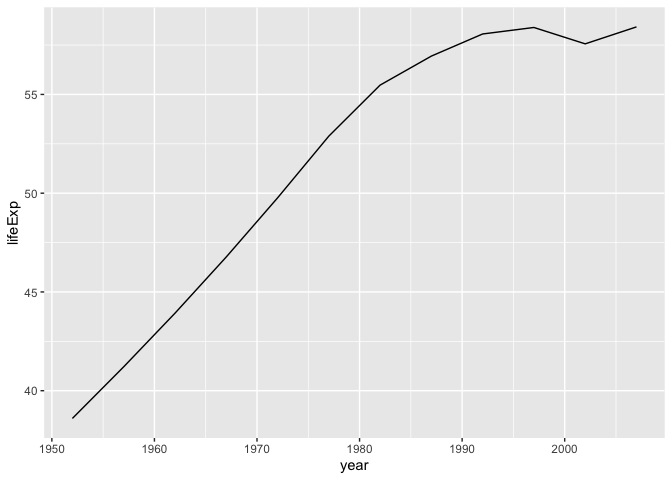
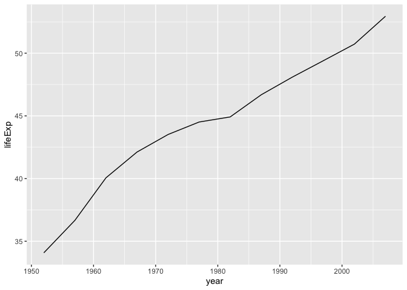
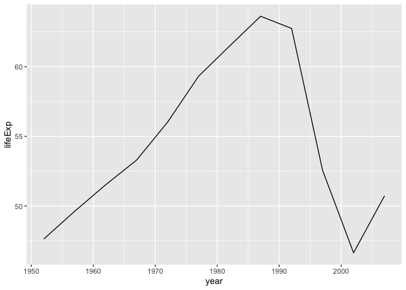
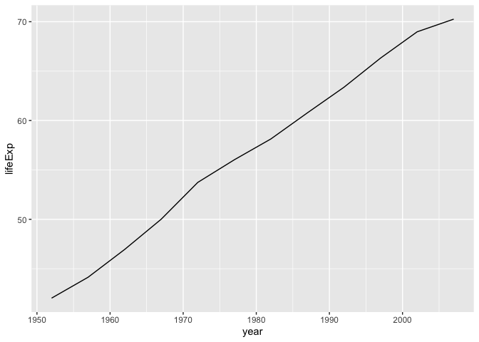
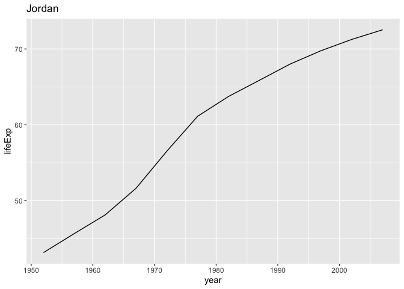
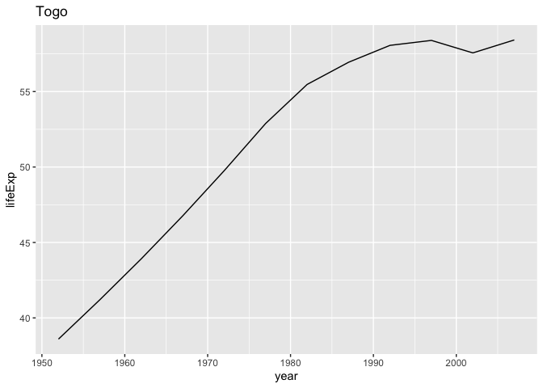
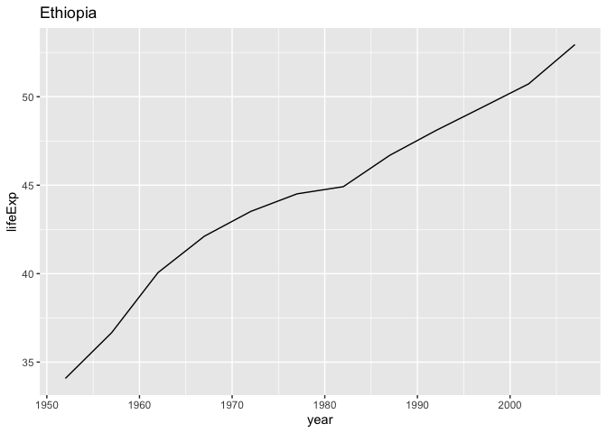
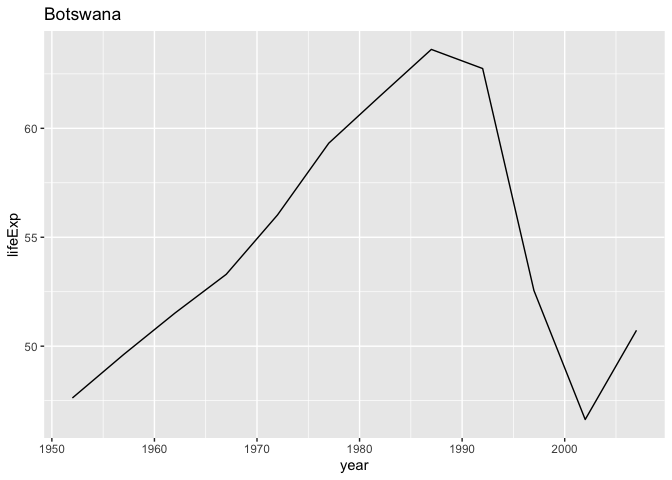
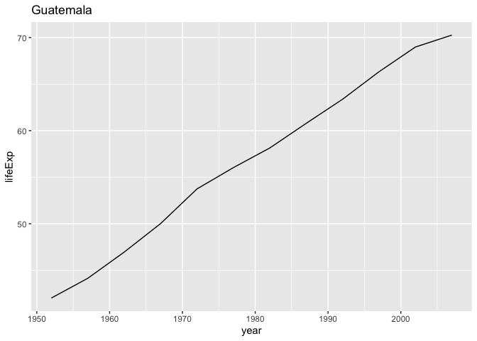

A brief introduction to purrr - Journalism R Unconference
================
Ryan Menezes
May 17, 2021

R’s [tidyverse](https://www.tidyverse.org/) comes with a very handy
package called [purrr](https://purrr.tidyverse.org/). If you’re
manipulating data in the tidyverse on a regular basis, you will likely
have a use for it. Let’s run through how it works and some workflows
where its usefulness will hopefully be apparent.

## The theory behind purrr

When you’re writing code, it’s likely that you’ll need to execute the
same task over and over again. Most programming languages, including R,
have a handy way of doing that: loops. They usually look something like
this:

``` r
for (item in a.thing.with.many.items) {
  # something happens to item
}
```

What purrr encourages you to do is embrace what computer scientists call
*functional programming*, turning the above example into something like
this:

``` r
a.plan.to.do.something = function(item) {
  # something happens to item
}

map(a.thing.with.many.items, a.plan.to.do.something)
```

In this case, we’ve written ahead of time the task we want to do to each
item and placed that into a function. Then we’ve called a different
function, `map()`, which goes over the items and applies the function to
each one.

It takes a little bit of forethought to write code this way, but the
upsides are numerous. Purrr provides major speed upgrades over loops
(thanks to execution done in the C language under the hood) and helps
you separate your code places where functions are defined and places
where functions are executed.

Let’s run through how the various `map()` functions work. I’ll start by
bringing in the entire tidyverse, usually the first line of code I write
at the top of any R script.

``` r
library(tidyverse)
```

    ## ── Attaching packages ─────────────────────────────────────── tidyverse 1.3.1 ──

    ## ✓ ggplot2 3.3.3     ✓ purrr   0.3.4
    ## ✓ tibble  3.1.1     ✓ dplyr   1.0.6
    ## ✓ tidyr   1.1.3     ✓ stringr 1.4.0
    ## ✓ readr   1.4.0     ✓ forcats 0.5.1

    ## ── Conflicts ────────────────────────────────────────── tidyverse_conflicts() ──
    ## x dplyr::filter() masks stats::filter()
    ## x dplyr::lag()    masks stats::lag()

As the printout shows, this is a shorthand for importing eight different
packages, one of which is purrr.

Here is a simple example using some made-up data. (I understand that
made-up data is not exactly the purview of journalists, and I typically
scoff at examples like this, but it’ll hopefully serve a purpose before
we move on.) Say I had three different collections of numbers, and I
wanted to get the mean for each group.

``` r
my.list = list(
  v1 = c(8, 8, 8),
  v2 = c(4, 16, 4),
  v3 = c(4, 0, 20)
)

my.list
```

    ## $v1
    ## [1] 8 8 8
    ## 
    ## $v2
    ## [1]  4 16  4
    ## 
    ## $v3
    ## [1]  4  0 20

Here’s how to get the averages purrr-style:

``` r
my.calcs = map(my.list, mean)

my.calcs
```

    ## $v1
    ## [1] 8
    ## 
    ## $v2
    ## [1] 8
    ## 
    ## $v3
    ## [1] 8

`map()` requires that you give it a few inputs:

1.  A collection of items to iterate over. There are two basic types of
    collections in R: vectors and lists. Vectors are a collection of
    items of the same type: logical values, integers, doubles (floating
    point numbers) and characters. While vectors are homogeneous by
    rule, lists are collections that can hold a variety of types. In my
    example above, I set up a list holding three integer vectors.

2.  A function to use on each item. If you’ve set up the function ahead
    of time, or you’re using a function that already exists in base R or
    a package, you must only refer to it by name (`mean`) as opposed to
    calling the function (`mean()`). There are ways to write the
    function without setting it up ahead of time, which we’ll cover
    later.

## Types of purrr functions

`map()` is at the heart of the package, but purrr functions come in a
variety of flavors with literate names. Perhaps you are familiar with
base R’s suite of `apply()` functions, such as `lapply()`, `tapply()`,
`sapply()` and more. purrr functions are similar but, in my view, named
in a way where it’s clearer what the inputs and outputs are.

Roughly, every function has a two-step convention for its name: A part
that specifies the *number of inputs* to the function and a part that
specifies the *type of the output*.

### Number of inputs

With every purrr mapping function, the *last* input is always the custom
function we want to use to manipulate our data. Let’s call that `.f` in
these examples.

There are roughly three ways to pass inputs, each with a different purrr
function:

  - `map(.x, .f)` to work on one collection of items.
  - `map2(.x, .y, .f)` to work on two collections of similar size in
    parallel. In this case, your function needs to accept two arguments,
    which it will receive in pairs.
  - `pmap(.l, .f)` to work on a list of items. You’ll need this when you
    want to work on three or more collections in parallel. Those
    collections must all be the same size and need to go into a list
    (`.l`). The function should accept as many arguments as there are
    collections in the list.

### Type of output

`map()` by default will return a list, as we saw above. However, there
are handy ways to turn the output into an atomic vector with some slight
tweaks to the function’s name. This happens with the addition of an
underscore and a shorthand name of a type. There’s `map_lgl()` for
logical vectors, `map_chr()` for character vectors and many more. (See
`?map` for the full list.) This applies to every variation on the number
of inputs, so you can mix and match to get `map2_chr()` or `pmap_lgl()`
as you need it.

Let’s revisit the brief example from above. It returned a list with
three numbers. It could have easily been tweaked to return a vector with
three floating-point numbers:

``` r
my.calcs2 = map_dbl(my.list, mean)
my.calcs2
```

    ## v1 v2 v3 
    ##  8  8  8

It may not be readily apparent if you’re not familiar with the
differences between how R prints out lists compared to vectors, but our
output has changed slightly. We can check the class of each output to
see it:

``` r
class(my.calcs)
```

    ## [1] "list"

``` r
class(my.calcs2)
```

    ## [1] "numeric"

You’ll also notice a difference in the environment pane of RStudio if
you’re following along with this example. `my.calcs` should be listed as
a `List of 3` while `my.calcs2` should say `Named num [1:3] 8 8 8`, a
sign that the latter is a vector.

Thankfully, if you’re working with tabular data, you’ll rarely have to
peek under the hood like this. The specifics of what needs to be
inputted and outputted will hopefully be a little more clearer with a
more concrete example.

## Using purrr in data analysis

purrr really shines when it’s used in a analysis workflow to manipulate
your tabular data.

I’ll assume that you have some basic knowledge of the tidyverse (if not
I highly recommend [R for Data Science](https://r4ds.had.co.nz/), an
excellent free resource that covers the entirety of the tidyverse,
including purrr).

We’re going to attempt a task that should be familiar to most
journalists: You receive a data set that spans multiple files, with one
file for each year of the data. You then need to bring them all in to R
and assemble a single file.

In the `data/` folder of this repository you’ll see yearly CSVs for the
gapminder data set on the health and wealth of nations, popularized by
the late [Hans Rosling](https://en.wikipedia.org/wiki/Hans_Rosling).
Let’s read one in to take a look:

``` r
read_csv('data/1952.csv')
```

    ## 
    ## ── Column specification ────────────────────────────────────────────────────────
    ## cols(
    ##   country = col_character(),
    ##   continent = col_character(),
    ##   lifeExp = col_double(),
    ##   pop = col_double(),
    ##   gdpPercap = col_double()
    ## )

    ## # A tibble: 142 x 5
    ##    country     continent lifeExp      pop gdpPercap
    ##    <chr>       <chr>       <dbl>    <dbl>     <dbl>
    ##  1 Afghanistan Asia         28.8  8425333      779.
    ##  2 Albania     Europe       55.2  1282697     1601.
    ##  3 Algeria     Africa       43.1  9279525     2449.
    ##  4 Angola      Africa       30.0  4232095     3521.
    ##  5 Argentina   Americas     62.5 17876956     5911.
    ##  6 Australia   Oceania      69.1  8691212    10040.
    ##  7 Austria     Europe       66.8  6927772     6137.
    ##  8 Bahrain     Asia         50.9   120447     9867.
    ##  9 Bangladesh  Asia         37.5 46886859      684.
    ## 10 Belgium     Europe       68    8730405     8343.
    ## # … with 132 more rows

Let’s begin a process to put this all together in a tabular fashion.
That means we’ll stick to using the tidyverse’s structures for
organizing data, namely tibbles, and the manipulation functions provided
by the dplyr package, such as `mutate()` to add new columns. This will
help us keep the file names (which we’ll need to extract the year field)
organized alongside the data (which lack a year field).

First, let’s start with a list of all the file names:

``` r
files = tibble(fname = list.files('data/')) %>% 
  mutate(fname = str_c('data/', fname)) # add the folder name to the beginning of the file path

files
```

    ## # A tibble: 12 x 1
    ##    fname        
    ##    <chr>        
    ##  1 data/1952.csv
    ##  2 data/1957.csv
    ##  3 data/1962.csv
    ##  4 data/1967.csv
    ##  5 data/1972.csv
    ##  6 data/1977.csv
    ##  7 data/1982.csv
    ##  8 data/1987.csv
    ##  9 data/1992.csv
    ## 10 data/1997.csv
    ## 11 data/2002.csv
    ## 12 data/2007.csv

With a combination of `mutate()` and `map()`, we can read in each file
and place the entire data frame in the same row as the file name:

``` r
files.read = files %>% 
  mutate(
    csv = map(
      fname, # input vector: a column from our tibble
      read_csv, # function: readr's read_csv
      # optional arguments to the function go after the function
      # readr will guess every single column type on every single read and print out the results
      # specifiying column types (which we know to be the same in each file) will stop the guessing and prevent a printout
      col_types = cols(
        country = col_character(),
        continent = col_character(),
        lifeExp = col_double(),
        pop = col_double(),
        gdpPercap = col_double()
      )
    )
  )

files.read
```

    ## # A tibble: 12 x 2
    ##    fname         csv                        
    ##    <chr>         <list>                     
    ##  1 data/1952.csv <spec_tbl_df[,5] [142 × 5]>
    ##  2 data/1957.csv <spec_tbl_df[,5] [142 × 5]>
    ##  3 data/1962.csv <spec_tbl_df[,5] [142 × 5]>
    ##  4 data/1967.csv <spec_tbl_df[,5] [142 × 5]>
    ##  5 data/1972.csv <spec_tbl_df[,5] [142 × 5]>
    ##  6 data/1977.csv <spec_tbl_df[,5] [142 × 5]>
    ##  7 data/1982.csv <spec_tbl_df[,5] [142 × 5]>
    ##  8 data/1987.csv <spec_tbl_df[,5] [142 × 5]>
    ##  9 data/1992.csv <spec_tbl_df[,5] [142 × 5]>
    ## 10 data/1997.csv <spec_tbl_df[,5] [142 × 5]>
    ## 11 data/2002.csv <spec_tbl_df[,5] [142 × 5]>
    ## 12 data/2007.csv <spec_tbl_df[,5] [142 × 5]>

One big plus of tidyverse tibbles is how it prints results to the
console. For one, it provides the type of each column (columns must
adhere to a single type). In this case we’ve created `csv` with the type
`<list>`. This is what’s referred to as a list-column. As mentioned
earlier, purrr’s `map()` by default returns a list. That was really the
only logical output here: The output of a `read_csv()` call is a tibble,
which is a fancy kind of list.

When it comes to this result, I like to think of each “cell” of the
`csv` column holding a table of its own. (You definitely cannot do this
in Excel.) The tibble printouts further help to see this: In the
console, each cell says something like `<spec_tbl_df[,5] [142 × 5]>`,
which means a 142-row, 5-column tibble is being held in that cell.

That printout obscures a lot of information, but it’s easy enough to
inspect an element at a time, using basic R notation for traversing into
lists:

``` r
files.read$csv[[1]]
```

    ## # A tibble: 142 x 5
    ##    country     continent lifeExp      pop gdpPercap
    ##    <chr>       <chr>       <dbl>    <dbl>     <dbl>
    ##  1 Afghanistan Asia         28.8  8425333      779.
    ##  2 Albania     Europe       55.2  1282697     1601.
    ##  3 Algeria     Africa       43.1  9279525     2449.
    ##  4 Angola      Africa       30.0  4232095     3521.
    ##  5 Argentina   Americas     62.5 17876956     5911.
    ##  6 Australia   Oceania      69.1  8691212    10040.
    ##  7 Austria     Europe       66.8  6927772     6137.
    ##  8 Bahrain     Asia         50.9   120447     9867.
    ##  9 Bangladesh  Asia         37.5 46886859      684.
    ## 10 Belgium     Europe       68    8730405     8343.
    ## # … with 132 more rows

That’s the same table as above, which checks out.

Now we can move to create our final data file, with the year column
added to each data set. Luckily there are handy tidyverse functions to
deal with exactly this type of data structure. They are called `nest()`
and `unnest()`. The former converts your data set into groups with
list-columns, the latter undoes that.

What we need here is a basic `unnest()`:

``` r
full.data = files.read %>% 
  # keep only the columns/modifications specified here
  transmute(
    # some modifications to clean up year and make an integer
    year = str_remove(fname, 'data/'),
    year = str_remove(year, '.csv'),
    year = as.integer(year),
    # keep the csv column
    csv,
  ) %>% 
  unnest(cols = c(csv)) # need to specify the list-column you want to unnest

full.data
```

    ## # A tibble: 1,704 x 6
    ##     year country     continent lifeExp      pop gdpPercap
    ##    <int> <chr>       <chr>       <dbl>    <dbl>     <dbl>
    ##  1  1952 Afghanistan Asia         28.8  8425333      779.
    ##  2  1952 Albania     Europe       55.2  1282697     1601.
    ##  3  1952 Algeria     Africa       43.1  9279525     2449.
    ##  4  1952 Angola      Africa       30.0  4232095     3521.
    ##  5  1952 Argentina   Americas     62.5 17876956     5911.
    ##  6  1952 Australia   Oceania      69.1  8691212    10040.
    ##  7  1952 Austria     Europe       66.8  6927772     6137.
    ##  8  1952 Bahrain     Asia         50.9   120447     9867.
    ##  9  1952 Bangladesh  Asia         37.5 46886859      684.
    ## 10  1952 Belgium     Europe       68    8730405     8343.
    ## # … with 1,694 more rows

The final result is the full gapminder data set of 1,704 rows.
`unnest()` has taken that year column and placed it alongside every row
in the tibble it was sitting alongside, then taken those tibbles and
stacked them on top of each other, giving us one clean data set.

While it’s not necessary to use purrr’s functions alongside tibbles like
this, I hope the benefits are clear. By employing a list-column
workflow, it helps keep groups of data organized. You’ll hopefully have
to think less about the inputs and outputs of your purrr function as
well: With everything visually laid out in a grid, it’ll be easier to
see what you need to put in and read what the mapping function has
output.

Let’s try one more slightly complicated example that illustrates this.

## Many plots

Let’s go through another workflow which journalists may have a need for.
Say we wanted to make a plot for each country, looking at its life
expectancy over time. (For the sake of simplicity we’ll do five plots,
but this can easily be extended.)

First, we need our data grouped by country. This requires us to nest the
final data set from above. The simplest way I’ve found to do this is to
ask for a grouping, before calling `nest()`:

``` r
set.seed(1)

by.country = full.data %>% 
  group_by(country) %>% 
  nest() %>%
  # keep only five randomly selected counties for this example
  ungroup() %>% 
  sample_n(5)

by.country
```

    ## # A tibble: 5 x 2
    ##   country   data                 
    ##   <chr>     <list>               
    ## 1 Jordan    <tibble[,5] [12 × 5]>
    ## 2 Togo      <tibble[,5] [12 × 5]>
    ## 3 Ethiopia  <tibble[,5] [12 × 5]>
    ## 4 Botswana  <tibble[,5] [12 × 5]>
    ## 5 Guatemala <tibble[,5] [12 × 5]>

Now we’ll use that `data` list-column to make a plot.

So far, we’ve used functions that have already been written as part of a
package. This time, we’ll need a custom function: It’ll need to take
this particular tibble and send it to a `ggplot()` call with all of the
right parameters.

While it’s nice to have a named function to place into your purrr
function, oftentimes you’ll want to test things out before writing a
separate function. Purrr provides ways to define inline functions. They
begin with a tilde `~` and accept some shorthand arguments: `.x` for the
first argument and (in the case of a `map2()` call) `.y` for the second
argument.

Here’s how we can quickly send our data column, which becomes `.x`, into
`ggplot()` to begin the process of creating plots for each country:

``` r
plots = by.country %>% 
  mutate(
    plot = map(
      data,
      ~.x %>%
        ggplot(aes(year, lifeExp)) +
        geom_line()
    )
  )

plots
```

    ## # A tibble: 5 x 3
    ##   country   data                  plot  
    ##   <chr>     <list>                <list>
    ## 1 Jordan    <tibble[,5] [12 × 5]> <gg>  
    ## 2 Togo      <tibble[,5] [12 × 5]> <gg>  
    ## 3 Ethiopia  <tibble[,5] [12 × 5]> <gg>  
    ## 4 Botswana  <tibble[,5] [12 × 5]> <gg>  
    ## 5 Guatemala <tibble[,5] [12 × 5]> <gg>

Again, tibbles helpfully provide a nice printout to see what we’re
working with. We have a list-column in `plot`, with each cell holding a
`<gg>` object, which should be a the plots themselves. Let’s take a look
at that column to see what we made:

``` r
plots %>% pull(plot) # equivalent to plots$plot
```

    ## [[1]]

<!-- -->

    ## 
    ## [[2]]

<!-- -->

    ## 
    ## [[3]]

<!-- -->

    ## 
    ## [[4]]

<!-- -->

    ## 
    ## [[5]]

<!-- -->

These plots serve a basic purpose. What would be a little bit nicer is
if we could know which country corresponds to each plot. The country
name is already on the same line as the data set. It’s easy enough to
add, it only requires a tweak to call `map2()` instead of `map()`. The
country name column will slide into the second argument, bumping the
inline function to the third argument. Calling `map2()` will also create
a `.y` variable inside the function. Since `data` comes first in the
function call, that gets assigned to `.x` and `country` to `.y`.

``` r
plots = by.country %>% 
  mutate(
    plot = map2(
      data,
      country,
      ~.x %>%
        ggplot(aes(year, lifeExp)) +
        geom_line() +
        ggtitle(.y)
    )
  )

plots %>% pull(plot)
```

    ## [[1]]

<!-- -->

    ## 
    ## [[2]]

<!-- -->

    ## 
    ## [[3]]

<!-- -->

    ## 
    ## [[4]]

<!-- -->

    ## 
    ## [[5]]

<!-- -->

With the help of the labels it’s slightly easier to see that Botswana is
the country which suffered the steep dip in life expectancy (this is due
to a [long-lasting HIV/AIDS
epidemic](https://en.wikipedia.org/wiki/HIV/AIDS_in_Botswana) in the
country that still persists to this day).

Finally, let’s save these plots to a folder. We can use a purrr style
workflow to do that as well. This time we’ll use the `walk()` function,
which is identical to `map()` except that it returns nothing. Since we’d
like to only save plots and do nothing else, a `walk()` will work fine
here. This also doesn’t need to stick to the tabular workflow we have
used above, since nothing needs to be added as a column to the tibble.

``` r
walk2(
  plots$plot,
  plots$country,
  ~ggsave(
    filename = str_c('plots/', .y, '.png'),
    plot = .x
  )
)
```

    ## Saving 7 x 5 in image
    ## Saving 7 x 5 in image
    ## Saving 7 x 5 in image
    ## Saving 7 x 5 in image
    ## Saving 7 x 5 in image

The examples using `map2()` and `walk2()` highlight a hidden advantage
of adapting the list-column workflow I’ve outlined above: One of the
restrictions on using the functions with two inputs is that the inputs
must be of the same length. The functions will throw an error if this
condition is not met. But if you’re passing tibble columns into a purrr
function, it’s virtually impossible to violate this requirement, since
columns are always created with the same length as the number of rows in
the tibble.

## Other purrr resources

  - Jenny Bryan, a data scientist at RStudio and professor of statistics
    at the University of British Columbia, has a host of [purrr
    tutorials](https://jennybc.github.io/purrr-tutorial/). They are more
    focused on the fundamentals of purrr and less on the list-column
    workflow outlined here, but are helpful nonetheless. Her repurrrsive
    package helped me create the gapminder data files (see
    [create-data.R](/create-data.R) in this folder for that brief
    script).
  - I mentioned [R for Data Science](https://r4ds.had.co.nz/) earlier,
    an excellent introduction to all things tidyverse. The chapter
    called [Many Models](https://r4ds.had.co.nz/many-models.html) was
    particularly helpful for me when it came to understanding purrr. It
    explains how to create many different `lm()` objects and place them
    in a list-column.
  - A few words on the [furrr](https://furrr.futureverse.org/) package:
    Say you had to generate thousands of plots, instead of this limited
    example here. You might be interested in the furrr package, which
    runs purrr functions in parallel processes on your machine, to speed
    up your workflow. The under-the-hood mechanics of this are a little
    bit beyond me, but the package is really easy to use. Every purrr
    function has a furrr equivalent: You just need to prepend `future_`
    to the function call, creating `future_map()`, `future_map2()`,
    `future_pmap()` and more. That alone won’t give you the benefit of
    parallel processing, though. Furrr will import the
    [future](https://cran.r-project.org/web/packages/future/vignettes/future-1-overview.html)
    package, which enables asynchronous processing once you define a
    plan. Typically, I write `plan(multisession)` or `plan(multicore)`
    before using my furrr functions in parallel.
